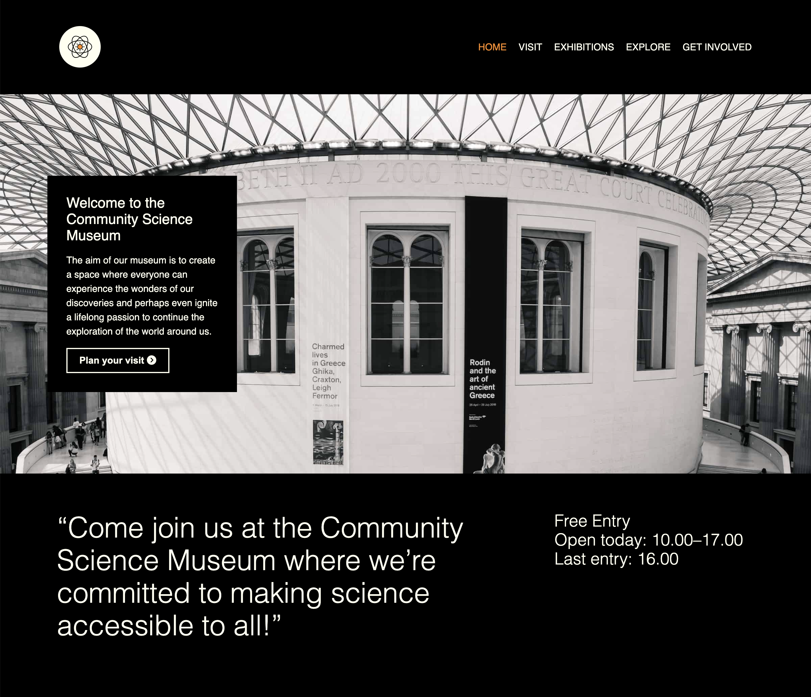

# Semester-Project



## Description

This was a school project and the objective was to create a website for a museum. It was built with only vanilla HTML & CSS

## Built with
- HTML
- CSS

## Getting started

### Installing

Clone the repo:
```
git clone https://github.com/lhvk/Semester-Project.git
```

### Dependencies
This project has no dependencies 

### Running
Fire up live server at the index.html and the site is live on your localhost.

## Contact

[Please visit my personal repo for contact information](https://github.com/lhvk)

## Acknowledgments

#### Noroff School of Technology and Digital Media
* Provided some stock footage

#### Unsplash for the rest of the footage
* [Unsplash](https://www.unsplash.com)

